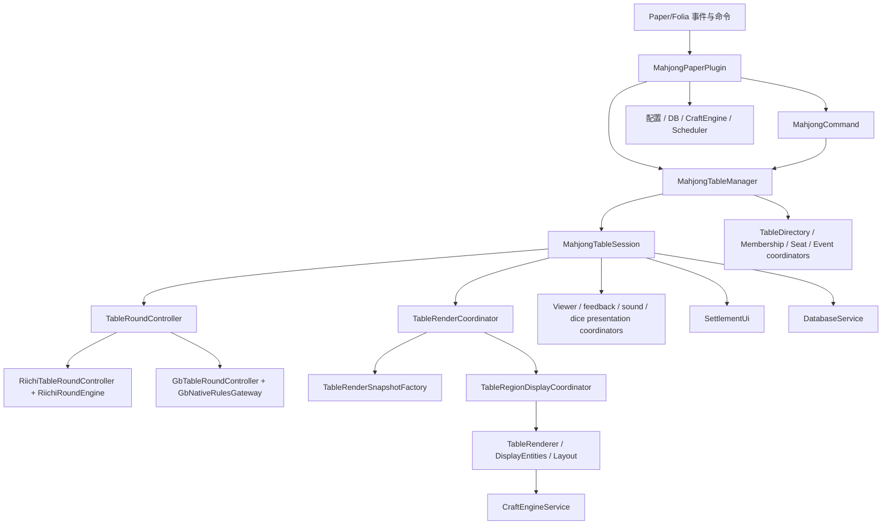

# MahjongPaper 架构梳理与优化建议

本文基于 2026-06-14 对当前工作区源码、构建脚本、CI、测试布局和文档的检查结果整理。它侧重架构边界和后续优化优先级，不改变现有运行行为。

## 项目定位

MahjongPaper 是一个面向 Paper/Folia 的 Minecraft 麻将插件。当前主线已经覆盖：

- 可持久化牌桌、大厅入座、准备、观战、机器人和结算 UI
- 日麻流程、分数结算和玩家状态
- 国标麻将流程、JNI 规则评估和 GB-Mahjong 原生库封装
- Paper display entity 渲染、CraftEngine 自定义物品/家具/交互桥接
- H2 默认持久化，MariaDB/MySQL 可选
- Gradle 资源生成、资源包校验、CraftEngine bundle 生成和跨平台 native 打包

## 顶层结构

```text
src/main/java/top/ellan/mahjong
  bootstrap/     插件生命周期、配置重载、服务装配
  command/       /mahjong 命令入口和命令路由
  table/         牌桌、会话、参与者、事件、渲染协调、局流程
  render/        display entity 生成、布局、可见性和点击动作
  riichi/        日麻规则引擎、玩家状态、役满包牌等规则细节
  gb/            国标规则网关、JNI 加载和原生模型
  compat/        CraftEngine 反射桥、bundle 导出、家具/物品兼容
  db/            对局历史、持久化牌桌、雀魂式段位资料
  ui/            结算背包 UI 和付款展示
  config/i18n/   配置快照、本地化消息
  runtime/       Folia/Paper 调度与异步服务
  metrics/       轻量指标采集

src/main/kotlin/top/ellan/mahjong
  riichi/        Kotlin 日麻核心模型和引擎
  gb/jni/        Kotlin serialization native 请求/响应模型

native/gbmahjong
  JNI 封装和 vendored GB-Mahjong C++ 源码

resourcepack
  MahjongPaper 资源包、模型、纹理、CraftEngine 用物品定义
```

## 当前职责流



## 规模与热点

主源码约 108 个 Java/Kotlin 文件、约 2.26 万行。代码量主要集中在这些区域：

- `table`: 56 文件，约 1.00 万行，是核心域和协调层
- `render`: 10 文件，约 3895 行，是显示实体和布局实现
- `riichi`: 6 文件，约 3045 行，是日麻规则核心
- `compat`: 2 文件，约 1289 行，主要是 CraftEngine 反射桥
- `db`: 4 文件，约 1118 行，集中管理 SQL 和段位持久化

单文件热点：

- `TableRenderer.java`: 1936 行
- `MahjongTableSession.java`: 1461 行
- `GbTableRoundController.java`: 1367 行
- `RiichiPlayerState.kt`: 1310 行
- `CraftEngineService.java`: 1276 行
- `DisplayEntities.java`: 1030 行
- `RiichiRoundEngine.kt`: 977 行
- `DatabaseService.java`: 776 行
- `MahjongTableManager.java`: 708 行
- `MahjongCommand.java`: 703 行

这些文件多数不是“坏味道”本身，而是已经成为业务复杂度聚集点。后续优化应优先降低修改这些文件时的认知负担和回归风险。

## 做得好的地方

- 已有明确运行入口：`MahjongPaperPlugin` 负责生命周期、配置快照和服务装配。
- 牌局变体已经抽象到 `TableRoundController`，日麻和国标能挂在同一个桌面会话下。
- `MahjongTableSession` 已经开始通过 coordinator 拆分生命周期、渲染、展示、规则、手牌选择和局流程。
- 渲染链路使用 snapshot、fingerprint、region apply budget，说明已经认真处理异步预计算、区域线程和 display entity 更新成本。
- CI 覆盖测试、跨平台构建、native 平台 jar 和 universal jar 组装。
- 普通测试和 perf 测试已经分离，性能基线有文档说明。
- 构建脚本会校验麻将牌资源、生成本地化配置和 CraftEngine bundle，资源一致性不是全靠人工。

## 主要风险

### 1. 会话对象仍然承担过多“总线”职责

`MahjongTableSession` 同时暴露参与者、准备、规则、局状态、渲染、展示、点击菜单、结算、倒计时、bot、持久化等接口。虽然内部已有 coordinator，但外部和内部 coordinator 仍大量回调 session。这会导致：

- 新功能容易直接加到 session，继续变胖
- coordinator 的职责边界不够稳定
- 测试时需要构造接近真实 session 的大对象

建议方向：把 session 逐步压缩成 facade，拆出更窄的端口对象，例如 `TableMembershipPort`、`RoundStateView`、`RenderStateView`、`PresentationPort`，让 coordinator 只依赖自己需要的端口。

### 2. 渲染实现同时包含布局、实体生成、CraftEngine 分支和区域 spec

`TableRenderer` 同时处理桌体、座位、墙牌、宝牌、手牌、河牌、副露、观战 overlay、实体生成、CraftEngine 家具配置和诊断。`TableRenderLayout` 已经承担一部分布局，但渲染器仍是热点。

建议方向：先按区域拆，而不是按技术拆：

- `TableStructureRenderer`
- `SeatRenderer`
- `WallRenderer`
- `HandRenderer`
- `DiscardRenderer`
- `MeldRenderer`
- `ViewerOverlayRenderer`

这些小 renderer 输出统一的 `DisplayEntities.EntitySpec`，最终实体应用仍由 `TableRegionDisplayCoordinator` 负责。

### 3. `TableRoundController` 接口偏“胖”

该接口既包含动作命令、状态查询、渲染查询、bot 建议、反应窗口、不同规则的能力开关。随着变体增加，默认方法会越来越多。

建议方向：拆成能力接口：

- `RoundActions`
- `RoundPublicState`
- `RoundRenderState`
- `ReactionCapableRound`
- `BotSuggestingRound`
- `RiichiSpecificRound`
- `GbSpecificRound`

现有 `TableRoundController` 可以先保留为组合门面，避免一次性大改。

### 4. 国标控制器混合了流程、规则请求映射和 bot 策略

`GbTableRoundController` 已经实现了主要国标流程，但它同时负责：

- 一局流程状态机
- chi/pon/kan/ron/tsumo 反应解析
- native fan/ting/win 请求组装
- settlement 映射
- bot 出牌/鸣牌/杠牌选择

建议方向：优先拆出 `GbBotDecisionService` 和 `GbNativeRequestFactory`。这两个拆分收益高、风险低，不需要先改变核心状态机。

### 5. CraftEngine 适配层是必要复杂，但可读性风险高

`CraftEngineService` 通过反射兼容物品、家具、交互事件、tracked culling 和 anti-cheat 映射。反射集中管理是合理的，但当前文件包含太多桥接主题。

建议方向：

- `CraftEngineItemBridge`
- `CraftEngineFurnitureBridge`
- `CraftEngineInteractionBridge`
- `CraftEngineCullingBridge`
- `CraftEngineBundleExporter`

`CraftEngineService` 保留为 facade 和配置入口。

### 6. 命令入口偏手写路由

`MahjongCommand` 用一个大 switch 处理所有子命令，短期直接，长期容易造成权限、参数、提示、本地化和变体能力判断散落。

建议方向：引入轻量 `MahjongSubcommand` 注册表，每个命令类只关心自己的参数和执行。先迁移 admin 命令或只读命令，避免一次性改完。

### 7. 文档有少量路径漂移

部分文档仍引用旧包名路径，实际源码已经在 `top.ellan.mahjong` 下。建议作为低风险整理项修正，避免后续维护者按旧路径找代码。

## 优化路线

### 第一阶段：不改行为的整理

- 修正文档中的旧包名路径。
- 增加一份“模块边界约定”，明确 `table`、`render`、`riichi`、`gb`、`compat` 的依赖方向。
- 在测试里补一两个“架构哨兵”：例如禁止 `riichi` 依赖 Bukkit/Paper，限制 `render` 直接依赖 `db`。
- 把 `build.gradle.kts` 中资源生成/native 构建逻辑迁移到 `buildSrc` 或 convention plugin，降低根构建脚本体量。

### 第二阶段：低风险拆分

- 从 `GbTableRoundController` 拆出 `GbBotDecisionService`。
- 从 `GbTableRoundController` 拆出 `GbNativeRequestFactory`。
- 从 `TableRenderer` 拆出 seat/hand/discard/meld/overlay renderer，保持输出 spec 不变。
- 从 `MahjongCommand` 拆出 admin 子命令和只读子命令。

### 第三阶段：边界收紧

- 把 `MahjongTableSession` 改为更薄的 facade，coordinator 依赖窄接口而不是完整 session。
- 拆分 `TableRoundController` 能力接口，让日麻/国标/未来变体只实现自己需要的能力。
- 把 `CraftEngineService` 收缩为 facade，反射桥按主题分文件。
- 把 `DatabaseService` 中 schema、SQL dialect、rank profile、round history 分离，降低数据库变更影响面。

### 第四阶段：性能与运行时优化

- 继续使用 `perfTest` 做渲染 snapshot、layout precompute、region fingerprint、GB bot 建议和 native gateway cache 的前后对比。
- 对 display region apply budget 做压力测试，确认高并发多桌场景下不会长时间延迟关键 hand/reaction 更新。
- 对 JNI 首次调用和热调用做平台基线，避免在没有数据时引入更复杂的 native call pool。

## 建议的依赖方向

推荐保持如下方向，减少循环理解成本：

```text
bootstrap -> config/runtime/db/compat/table/command
command   -> table/i18n/db
table     -> riichi/gb/render/ui/metrics/runtime/model
render    -> model + render DTO/spec，尽量只通过窄 view 读取 table 状态
riichi    -> 纯规则/模型，避免 Bukkit/Paper
gb        -> native gateway + 规则映射，避免 UI/render 细节
compat    -> CraftEngine/Paper 适配，业务层只调用 facade
db        -> 持久化模型和 SQL，避免依赖 render/UI
ui        -> 展示结算结果，尽量只依赖结算 DTO
```

## 验证记录

- 使用项目本地 `.gradle-home` 执行普通测试：通过。
- 测试报告汇总：43 个测试类，208 个用例，0 failure，0 error，0 skipped。
- 直接使用默认 Gradle wrapper 时，本机默认 Gradle 用户目录缺少发行版，且下载 Gradle 9.4.1 被 Java 证书信任链拦截；改用项目内 `.gradle-home` 后通过。
- 工作区检查后保持干净。
